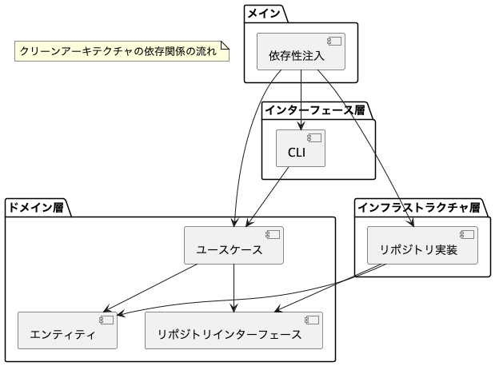

# クリーンアーキテクチャを採用したTODOアプリ

このプロジェクトは、Goでクリーンアーキテクチャを実践するためのシンプルなTODOアプリケーションです。

## アーキテクチャの概要

このアプリケーションは以下のレイヤーで構成されています：

### ドメイン層 (`domain/`)
- エンティティ (`entity/`): ビジネスオブジェクトを定義
- リポジトリ (`repository/`): データアクセスのインターフェースを定義
- ユースケース (`usecase/`): アプリケーションのビジネスロジックを実装

### インフラストラクチャ層 (`infrastructure/`)
- インメモリリポジトリ (`inmemory/`): メモリ内でのデータ永続化を実装

### インターフェース層 (`interface/`)
- CLI (`cli/`): コマンドラインインターフェースを実装

### メイン (`main.go`)
- 依存性の注入と実行エントリポイント

## アーキテクチャ図



## 実行方法

```bash
go run main.go
```

## 機能

- タスクの追加
- タスクの完了マーク
- タスクの削除
- タスクリストの表示

## クリーンアーキテクチャの利点

1. **依存関係の方向**: 外側のレイヤーが内側のレイヤーに依存し、内側のレイヤーは外側のレイヤーに依存しない
2. **テスト容易性**: ビジネスロジックがインフラストラクチャから分離されているため、テストが容易
3. **柔軟性**: 実装の詳細（データベース、UI等）を変更しても、コアロジックに影響を与えない 
