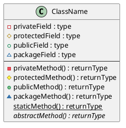
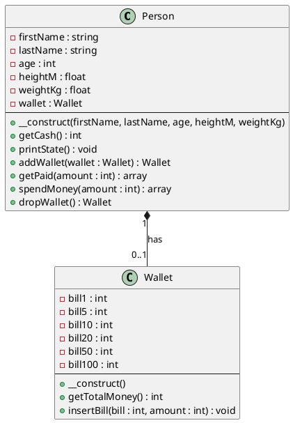

# PlantUML クラス図構文リファレンス

## 基本的なクラス定義


## クラスの種類
- `class` : 標準クラス
- `abstract class` : 抽象クラス
- `interface` : インターフェース
- `enum` : 列挙型
- `annotation` : アノテーション

## 可視性修飾子
- `-` : private（プライベート）
- `+` : public（パブリック）
- `#` : protected（プロテクテッド）
- `~` : package private（パッケージプライベート）

## 特別な修飾子
- `{static}` : 静的メンバー
- `{abstract}` : 抽象メソッド
- `{field}` : フィールド（自動ゲッター/セッター）

## クラス間の関係性

### 継承・実装
```plantuml
ClassA <|-- ClassB : extends（継承）
InterfaceA <|.. ClassC : implements（実装）
```

### 関連・依存
```plantuml
ClassA --> ClassB : dependency（依存）
ClassA ..> ClassB : weak dependency（弱い依存）
ClassA -- ClassB : association（関連）
ClassA .. ClassB : dotted association（点線関連）
```

### 集約・合成
```plantuml
ClassA o-- ClassB : aggregation（集約）
ClassA *-- ClassB : composition（合成）
```

### 多重度の指定
```plantuml
ClassA "1" -- "0..*" ClassB
ClassA "1..1" -- "1..*" ClassC
```

## パッケージとネームスペース
```plantuml
package "パッケージ名" {
  class ClassA
  class ClassB
}

namespace NamespaceName {
  class ClassC
}
```

## ノートとコメント
```plantuml
class ClassA {
  +method()
}

note left of ClassA : 左側のノート
note right of ClassA : 右側のノート
note top of ClassA : 上部のノート
note bottom of ClassA : 下部のノート

note left of ClassA::method
  メソッドに対するノート
end note
```

## スタイリング
```plantuml
skinparam class {
  BackgroundColor PaleGreen
  ArrowColor SeaGreen
  BorderColor SpringGreen
}

class ClassA #LightBlue
class ClassB ##[bold]red
```

## 使用例（Person-Wallet関係）


## よく使用される記号一覧

| 記号 | 意味 | 使用例 |
|------|------|---------|
| `<\|--` | 継承（extends） | `Parent <\|-- Child` |
| `<\|..` | 実装（implements） | `Interface <\|.. Class` |
| `-->` | 依存（dependency） | `ClassA --> ClassB` |
| `..>` | 弱い依存 | `ClassA ..> ClassB` |
| `--` | 関連（association） | `ClassA -- ClassB` |
| `..` | 点線関連 | `ClassA .. ClassB` |
| `o--` | 集約（aggregation） | `Whole o-- Part` |
| `*--` | 合成（composition） | `Whole *-- Part` |
| `-` | private | `- privateField` |
| `+` | public | `+ publicMethod()` |
| `#` | protected | `# protectedField` |
| `~` | package private | `~ packageMethod()` |

## 参考リンク
- [PlantUML公式サイト（クラス図）](https://plantuml.com/ja-dark/class-diagram)